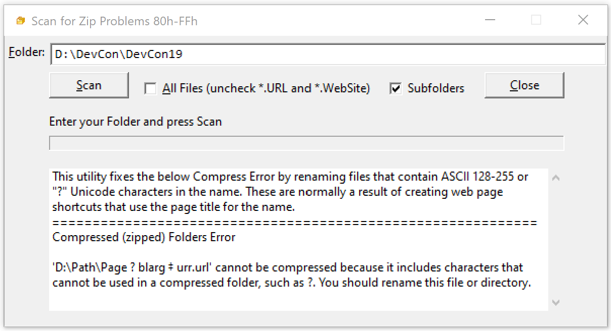
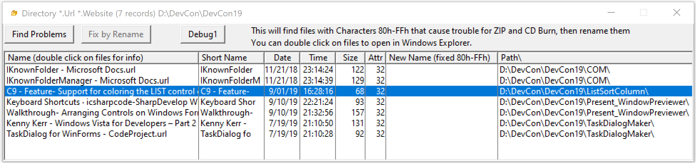

# ZipFileNameFixer

Zip files do not allow many high ASCII characters in file names.
 I typically get these dropping URL's into a folder. 
 This utility will find all files with problem characters and let you fix  this. 
 
On the main window enter a path and press the Scan button.
 Normally only .URL and .WEBSITE file extensions are checked, uncheck the box to scan all files

The next window lists all the files in the folders limited by file extension.

Click "Find Problems" to filter the list to problem files.
 The Short Name column shows the specific characters.
 Click "Fix Problems" to actually rename the files.
 Log file ZipFNFixLog.CSV is written.
 

